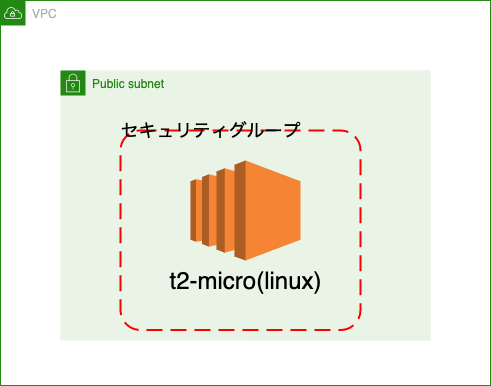

# min-ec2

## 作成するサービス

- vpc
- root テーブル
- internet gateway
- セキュリティグループ（22, 80 両方ともフルオープン）
- パブリックサブネット
- ec2 インスタンス（１）（アマゾン linux）

## 使いどき

雑に ec2 インスタンスを立てたいとき

nginx を使いたい時は以下コマンドを ssh して叩くこと

```shell
sudo yum update -y
# 日本時間と日本語に対応させる
sudo timedatectl set-timezone Asia/Tokyo
sudo localectl set-locale LANG=ja_JP.UTF-8
sudo localectl set-keymap jp106

# nginxを入れて起動するよ
sudo amazon-linux-extras install nginx1.12 -y
sudo cp -a /etc/nginx/nginx.conf /etc/nginx/nginx.conf.back
sudo systemctl start nginx
sudo systemctl enable nginx
systemctl status nginx
```

## 使い方

1. `terraform-example.txt` を参考に`terraform.tfvars` を作成する
2. `terraform plan` コマンドで適切に動くかを確認
3. `terraform apply` aws に適応

### other

削除方法：`terraform destroy`とすることで削除できる

## 作成するサービスの構成図


